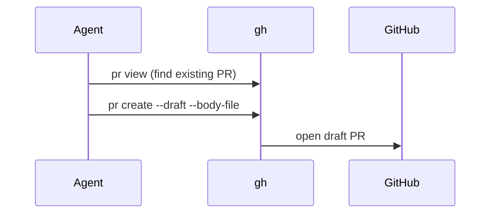

# Change Outline

A change outline is a small structural view in the **How** section. It shows the shape of the change faster than prose.
Use it when the bullets alone do not make clear where the change lives or how control or data now flows.

## Choose the Smallest View

| The change is mostly about...           | Show                         |
| --------------------------------------- | ---------------------------- |
| Where responsibilities live or move     | Shallow file tree            |
| A new or changed runtime path           | Call tree or control flow    |
| Changed business logic or a state rule  | Pseudocode                   |
| A new or changed type, schema, or API   | Data shape or contract       |
| UI composition, hooks, or state         | Component tree               |
| Interaction between services or actors  | Mermaid sequence diagram     |

Rules:

- Use one to three views. Each view has one short sentence before it and stays under about 15 lines.
- Use `diff` when the surrounding shape already exists and the point is what changes.
- Show the complete target shape in a language or `text` block when most of it is new, or when diff markers would
  hide ownership or order.
- Use real names from the diff: files, functions, types, commands. Keep only what a reviewer needs.
- Order the views to tell the story. Often that is the contract or data shape first, then the flow that uses it.
- Omit views for things that did not change. Never add a view only to fill space.

## Examples

File responsibilities moved into a new module:

```diff
 lib/
 ├── common.sh          # logging, execute()
-├── install.sh         # installers and prerequisites
+├── install.sh         # per-tool installers
+└── install-deps.sh    # runtimes, formatters, MCP binaries
```

A step added to an existing call path:

```diff
 copy_configurations
   copy_claude_configs
+  validate_configs
   copy_opencode_configs
```

A changed rule, as pseudocode:

```diff
 on(save)
-  write content
+  if content is unchanged
+    return cached result
+  write new content
+  invalidate cache
```

A new data shape:

```ts
type DraftPullRequest = {
	title: string;
	base: string;
	bodyFile: string;
	existingNumber?: number;
};
```

An interaction between actors (GitHub renders Mermaid):


