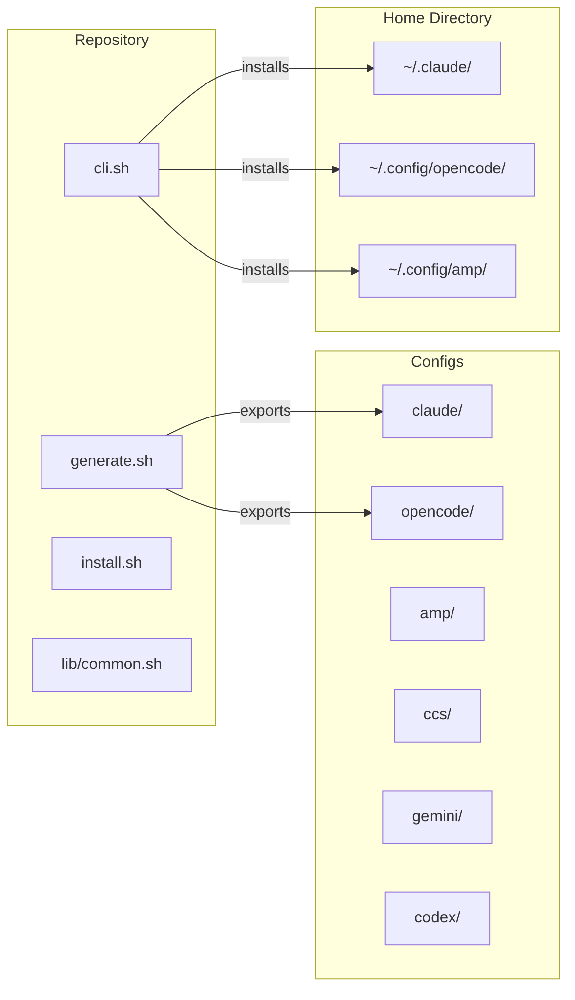

# Architecture

The repository follows a centralized configuration management pattern with bidirectional sync capabilities.

## High-Level Design



## Core Components

### Installation Scripts

| Script | Purpose |
|--------|---------|
| `cli.sh` | Main installer - copies configs from repo to home directory |
| `generate.sh` | Export tool - copies configs from home directory back to repo |
| `install.sh` | Direct installer - curl-based one-line installation |
| `install.ps1` | PowerShell installer for Windows |

### Common Library

`lib/common.sh` provides shared utilities:
- Color output functions (log_info, log_success, log_warning, log_error)
- Cross-platform path handling (normalize_path)
- OS detection (Windows vs Unix-like)
- Temp directory management
- Dry-run execution wrapper

### Configuration Structure

Each tool has its own directory under `configs/` with tool-specific files:

- Claude: `settings.json`, `mcp-servers.json`, `commands/`, `agents/`, `hooks/`, `skills/`
- OpenCode: `opencode.json`, `agent/`, `command/`, `skills/`
- Others follow similar patterns

## Data Flow

1. **Forward Sync (Install)**
   ```bash
   ./cli.sh --dry-run  # Preview changes
   ./cli.sh            # Execute installation
   ```
   - Validates prerequisites (git, bun/node, jq)
   - Backs up existing configs (optional)
   - Copies config files to appropriate home directory locations

2. **Reverse Sync (Export)**
   ```bash
   ./generate.sh --dry-run  # Preview changes
   ./generate.sh             # Execute export
   ```
   - Reads current home directory configs
   - Copies them back to the repo for version control

## Hooks System

The repository provides several hook types:

- **PostToolUse** — Auto-format code after edits
- **PreToolUse** — Git Guard to prevent destructive commands, WebSearch transformation
- **Auto-save hooks** — Save session context to MemPalace memory

## MCP Server Integration

MCP servers are configured per tool:
- context7 — Documentation lookup
- sequential-thinking — Multi-step reasoning
- qmd — Knowledge management
- fff — Fast file search
- mempalace — AI memory system
